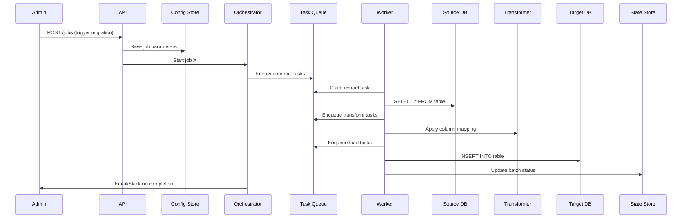
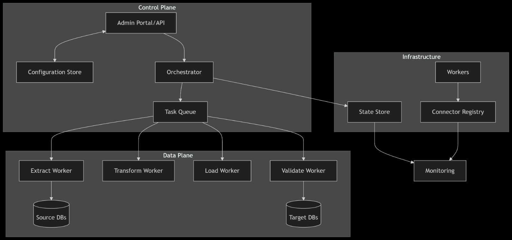
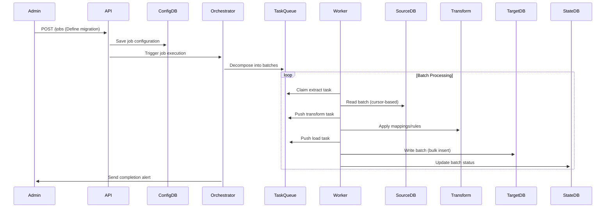

# Batch Database Migration Architecture

## Core Workflow

### Configuration

- Admin defines migration jobs via API
- Configurations stored in Configuration Store (DB schema with JSON flexibility)

### Job Trigger

- Admin initiates migration via API
- Orchestrator receives job request

### Task Decomposition

- Orchestrator breaks job into parallelizable tasks
- Tasks pushed to Task Queue (Kafka/RabbitMQ)

### Worker Execution

- Workers pull tasks from queue
- Specialized workers handle stages:
  - **Extract**: Pull data from source DB
  - **Transform**: Apply data mappings/rules
  - **Load**: Insert into target DB
  - **Validate**: Verify data integrity

### State Tracking

- Workers report progress to State Store
- Orchestrator monitors overall job status

## Key Components

| Component          | Responsibility                         | Technology Choices              |
| ------------------ | -------------------------------------- | ------------------------------- |
| Orchestrator       | Workflow management, task distribution | Spring Cloud Data Flow, Airflow |
| Task Queue         | Decoupled task delivery                | Kafka, RabbitMQ, SQS            |
| Worker Pool        | Scalable task execution                | Kubernetes Pods, ECS Tasks      |
| Connector Registry | DB-specific adapters                   | Pluggable Java modules          |
| State Store        | Job progress tracking                  | Redis, PostgreSQL, S3           |

## Critical Features

### Extensibility

- New DB connectors added via Registry without core changes
- Workers scale horizontally for large migrations

### Reliability

- Queue persistence ensures no task loss
- State tracking enables resume/retry

### Separation of Concerns

- Independent scaling of components
- Clear stage boundaries for debugging

### Observability

- State Store provides real-time progress
- Queue metrics for backlog monitoring

## Sequence Diagram (Textual)






## Scaling Mechanics

### Bottleneck Solution

- **Slow extraction?** → Add more Extract Workers
- **Complex transforms?** → Scale Transform Workers
- **DB write limits?** → Increase Load Workers

## Component Responsibilities

| Component           | Function                                 | Technology Examples    |
| ------------------- | ---------------------------------------- | ---------------------- |
| Admin Portal/API    | Job configuration & monitoring interface | Spring Boot REST API   |
| Configuration Store | Persists job definitions & mapping rules | PostgreSQL + JSONB     |
| Orchestrator        | Workflow engine for task sequencing      | Spring Cloud Data Flow |
| Task Queue          | Decouples stages, enables backpressure   | Kafka/RabbitMQ         |
| Worker Pool         | Scalable executors for ETL stages        | Kubernetes Pods        |
| Connector Registry  | Plugin repository for DB adapters        | Java ServiceLoader     |
| State Store         | Tracks batch-level progress & checksums  | Redis + PostgreSQL     |

<br>



# Batch Migration Tool Overview

## Overview

This tool enables batch migration of data between heterogeneous databases (e.g., PostgreSQL → Oracle) with:

- **Extensible connector framework**: Add new DBs via plugins
- **Configurable transformations**: Column mapping, data masking
- **Atomic batch processing**: Exactly-once delivery
- **Progress tracking**: Real-time monitoring

## Architecture Components

| Component               | Description                          | Technology             |
| ----------------------- | ------------------------------------ | ---------------------- |
| **Admin API**           | REST interface for job management    | Spring Boot            |
| **Configuration Store** | Stores job definitions               | PostgreSQL             |
| **Orchestrator**        | Workflow engine                      | Spring Cloud Data Flow |
| **Task Queue**          | Message broker for task distribution | RabbitMQ / Kafka       |
| **Worker Pool**         | Scalable task executors              | Kubernetes Pods        |
| **Connector Registry**  | Plugin system for DB adapters        | Java modules           |
| **State Store**         | Tracks job progress and status       | Redis + PostgreSQL     |

---

<br>

# Advantages of This Model

## Future-Proof Extensibility

- New DB connectors added without schema changes
- Transformation types extended via registry
- JSON schemas enforce configuration integrity

## Security by Design

- Secrets never stored in DB
- Audit trail for compliance
- Encryption support baked in

## Operational Efficiency

- Priority-based batch processing
- Where-clause for incremental loads
- Connector capability awareness

---

<br>

# Project Structure and Sample Job Request

## 📁 Directory Structure 1

```plaintext
src/
├── main/
│   ├── java/
│   │   └── com/
│   │       └── example/
│   │           └── migration/
│   │               ├── Application.java
│   │               ├── config/
│   │               ├── controller/
│   │               ├── service/
│   │               │   ├── MigrationService.java
│   │               │   ├── connector/
│   │               │   │   ├── DatabaseConnector.java
│   │               │   │   ├── JdbcConnector.java
│   │               │   │   ├── PostgresConnector.java
│   │               │   │   └── OracleConnector.java
│   │               │   └── transformation/
│   │               ├── model/
│   │               ├── repository/
│   │               └── scheduler/
│   └── resources/
│       ├── application.yml
│       └── data.sql
```

<br>

# Directory Structure 2

````plaintext
src/main/java/com/example/migration/
├── application/
│   └── MigrationApplication.java
├── config/
│   ├── AppConfig.java
│   ├── AsyncConfig.java
│   └── SecurityConfig.java
├── controller/
│   └── MigrationController.java
├── service/
│   ├── MigrationOrchestratorService.java
│   ├── connector/
│   │   ├── source/
│   │   │   ├── SourceConnector.java
│   │   │   ├── impl/
│   │   │   │   ├── PostgresSourceConnector.java
│   │   │   │   └── MySqlSourceConnector.java
│   │   └── destination/
│   │       ├── DestinationConnector.java
│   │       ├── impl/
│   │       │   ├── OracleDestinationConnector.java
│   │       │   └── SnowflakeDestinationConnector.java
│   │       └── registry/
│   │           └── ConnectorRegistry.java
│   ├── transformation/
│   │   ├── TransformationService.java
│   │   ├── impl/
│   │   │   ├── ColumnRenameTransformer.java
│   │   │   ├── DataMaskingTransformer.java
│   │   │   └── CustomScriptTransformer.java
│   │   └── registry/
│   │       └── TransformationRegistry.java
│   ├── state/
│   │   ├── MigrationStateService.java
│   │   └── impl/
│   │       ├── JdbcStateManager.java
│   │       └── RedisStateManager.java
│   └── validation/
│       └── DataValidationService.java
├── model/
│   ├── MigrationJob.java
│   ├── TableConfig.java
│   ├── BatchResult.java
│   ├── ConnectorType.java
│   └── TransformationDef.java
├── repository/
│   ├── JobRepository.java
│   └── entity/
│       ├── JobEntity.java
│       └── BatchStateEntity.java
├── scheduler/
│   └── JobScheduler.java
└── exception/
    ├── MigrationException.java
    ├── ConnectorException.java
    └── GlobalExceptionHandler.java


---

## 📤 Sample API Request

**Endpoint:** `POST /api/jobs`
**Headers:**

```http
Content-Type: application/json
````

**Request Body:**

```json
{
  "name": "Prod Customer Migration",
  "source": {
    "type": "POSTGRES",
    "host": "pg-db.example.com",
    "database": "customers",
    "secretsRef": "vault:/databases/pg-prod"
  },
  "destination": {
    "type": "ORACLE",
    "host": "oracle-db.example.com",
    "serviceName": "ORCL",
    "walletPath": "/secure/wallets/oracle"
  },
  "tables": [
    {
      "sourceSchema": "public",
      "sourceTable": "users",
      "destinationTable": "CUSTOMERS",
      "transformations": [
        {
          "type": "COLUMN_MAP",
          "mapping": {
            "id": "CUST_ID",
            "email": "EMAIL_ADDR"
          }
        },
        {
          "type": "DATA_MASK",
          "columns": ["ssn"],
          "maskChar": "X"
        }
      ]
    }
  ]
}
```

# Table Configurations

## `migration_job`

```sql
CREATE TABLE migration_job (
  job_id UUID PRIMARY KEY,
  name VARCHAR(255) NOT NULL,
  description TEXT,
  status VARCHAR(20) CHECK(status IN ('DRAFT','ACTIVE','PAUSED','COMPLETED')),
  created_at TIMESTAMP DEFAULT CURRENT_TIMESTAMP,
  updated_at TIMESTAMP DEFAULT CURRENT_TIMESTAMP
);
```

## `connector_config`

```sql
CREATE TABLE connector_config (
  config_id UUID PRIMARY KEY,
  job_id UUID REFERENCES migration_job(job_id),
  type VARCHAR(50) NOT NULL CHECK(type IN ('SOURCE','DESTINATION')),
  connector_type VARCHAR(50) NOT NULL,  -- e.g. POSTGRES, ORACLE, SNOWFLAKE
  config_json JSONB NOT NULL,           -- Connection details in DB-agnostic format
  secrets_ref VARCHAR(500)              -- Path to secrets manager
);
```

## `table_config`

```sql
CREATE TABLE table_config (
  table_id UUID PRIMARY KEY,
  job_id UUID REFERENCES migration_job(job_id),
  source_schema VARCHAR(100) NOT NULL,
  source_table VARCHAR(100) NOT NULL,
  destination_schema VARCHAR(100),
  destination_table VARCHAR(100),
  batch_size INT DEFAULT 5000,
  where_clause TEXT,                   -- For incremental migrations
  priority INT DEFAULT 5
);
```

## `transformation_config`

```sql
CREATE TABLE transformation_config (
  transform_id UUID PRIMARY KEY,
  table_id UUID REFERENCES table_config(table_id),
  type VARCHAR(50) NOT NULL,           -- e.g. COLUMN_MAP, DATA_MASK, CUSTOM_FUNCTION
  config_json JSONB NOT NULL,          -- Transformation parameters
  sequence INT NOT NULL                -- Execution order
);

```
